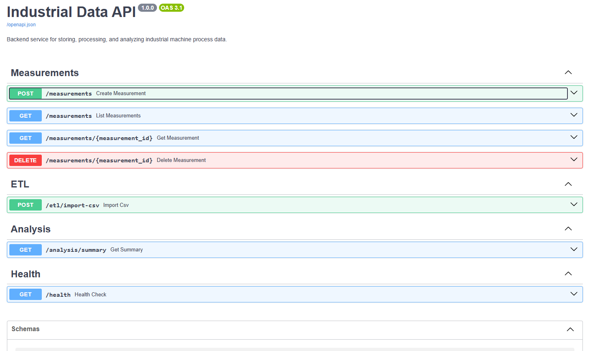
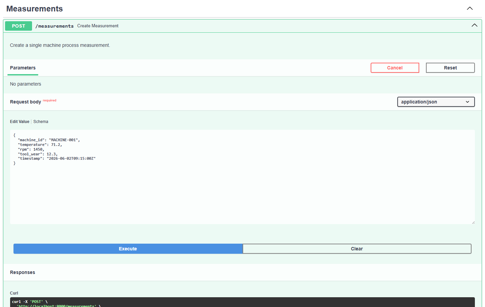
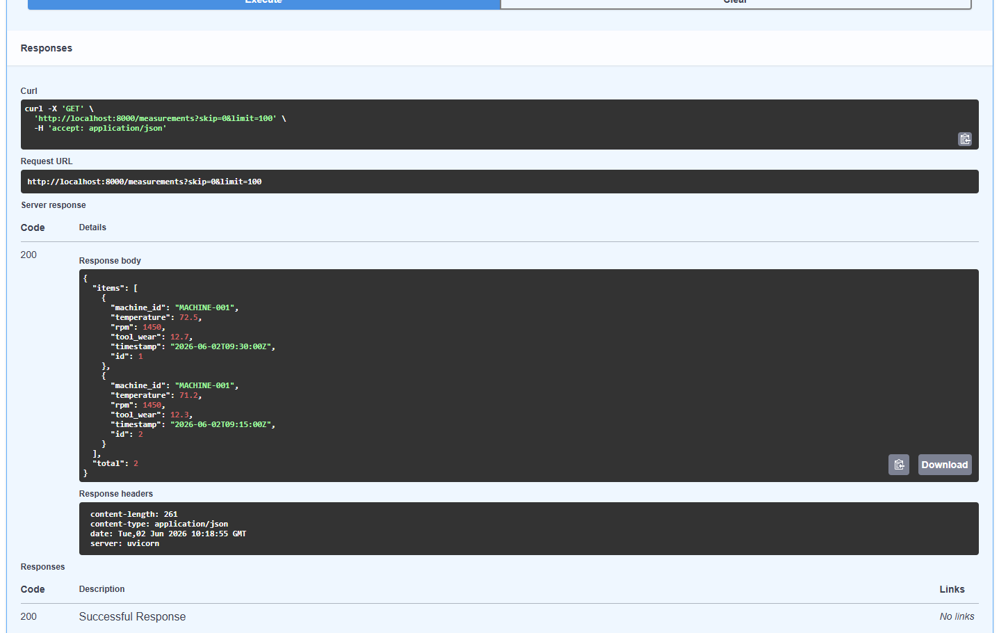
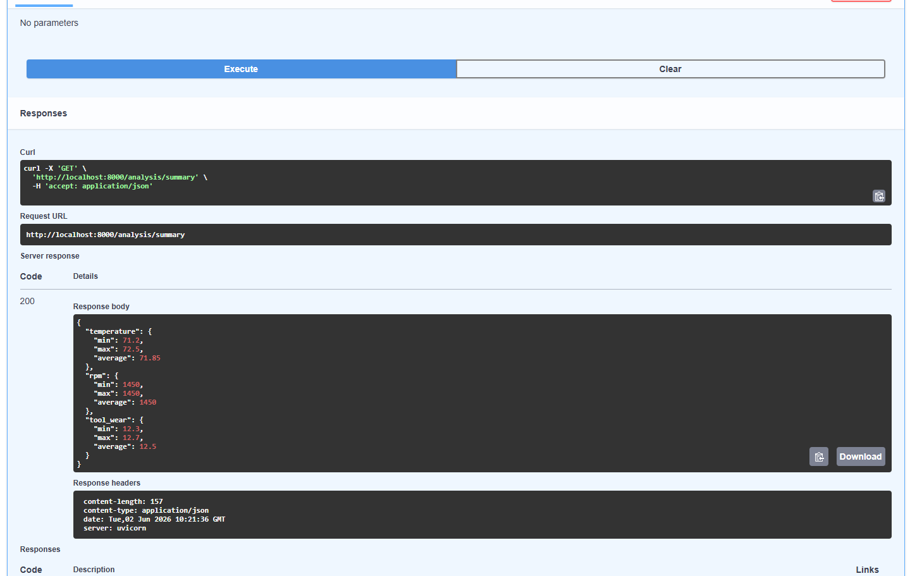

# Industrial Process Data API

A backend service for storing, processing, and analyzing industrial machine process data.

This project was developed to strengthen my backend and data engineering skills using technologies commonly found in modern data-driven software systems. The industrial monitoring use case was chosen because of my academic background in machine learning for manufacturing processes and my experience in industrial software development.

---

## Features

- REST API for machine measurements
- PostgreSQL data persistence
- CSV-based ETL import
- Statistical process analysis
- Dockerized deployment
- Input validation with Pydantic
- Automated API documentation with Swagger UI
- Automated tests

---

## Application Overview

The application provides a simple but realistic backend architecture for collecting, storing, processing, and analyzing industrial process data. Machine measurements can be created through REST endpoints, stored in PostgreSQL, imported from CSV files, and analyzed through aggregated statistics.

**Screenshot Placeholder – Main Swagger Overview**

```text

```

---

## Motivation

Modern industrial systems generate large amounts of machine and process data that must be collected, stored, and analyzed efficiently. This project demonstrates a typical backend workflow used in data-driven applications:

1. Data ingestion through REST APIs
2. Persistent storage in a relational database
3. ETL processing of external datasets
4. Statistical analysis of collected measurements
5. Containerized deployment using Docker

The project combines concepts from backend development, data engineering, and industrial analytics.

---

## Technology Stack

| Category | Technology |
|-----------|-----------|
| Language | Python 3.12 |
| API Framework | FastAPI |
| Database | PostgreSQL |
| ORM | SQLAlchemy |
| Validation | Pydantic |
| Containerization | Docker & Docker Compose |
| Testing | Pytest |
| Documentation | Swagger / OpenAPI |

---

## Architecture

```text
Client
   │
   ▼
FastAPI REST API
   │
   ├── Measurement Service
   ├── Analysis Service
   └── ETL Service
   │
   ▼
SQLAlchemy ORM
   │
   ▼
PostgreSQL Database
```

The architecture separates business logic from API endpoints through dedicated service layers. This keeps the codebase maintainable and scalable while following common backend development practices.

---

## Project Structure

```text
industrial-data-api/

├── app/
│   ├── main.py
│   ├── database.py
│   │
│   ├── models/
│   ├── schemas/
│   ├── routes/
│   ├── services/
│   └── config.py
│
├── images/
├── tests/
├── sample_data/
│
├── Dockerfile
├── docker-compose.yml
├── requirements.txt
└── README.md
```

---

# API Endpoints

## Measurements

| Method | Endpoint | Description |
|----------|----------|----------|
| POST | `/measurements` | Create measurement |
| GET | `/measurements` | List measurements |
| GET | `/measurements/{id}` | Get single measurement |
| DELETE | `/measurements/{id}` | Delete measurement |

### Creating Measurements

Machine process measurements can be created through a REST endpoint.

Example:

```json
{
  "machine_id": "MACHINE-001",
  "temperature": 71.2,
  "rpm": 1450,
  "tool_wear": 12.3,
  "timestamp": "2026-06-02T09:15:00Z"
}
```

**Screenshot Placeholder – Create Measurement**

```text

```

---

### Retrieving Measurements

Stored measurements can be queried through the API. Results are retrieved directly from PostgreSQL using SQLAlchemy ORM.

**Screenshot Placeholder – Measurement List**

```text

```

---

## ETL

| Method | Endpoint | Description |
|----------|----------|----------|
| POST | `/etl/import-csv` | Import measurement data from CSV |

The ETL endpoint allows bulk ingestion of measurement data from external CSV files.

Workflow:

```text
CSV File
   │
   ▼
Validation
   │
   ▼
Transformation
   │
   ▼
PostgreSQL Import
```

This simulates a common data engineering workflow for loading external process datasets.

---

## Analysis

| Method | Endpoint | Description |
|----------|----------|----------|
| GET | `/analysis/summary` | Statistical summary |

The analysis endpoint calculates:

- Minimum values
- Maximum values
- Average values

for:

- Temperature
- RPM
- Tool Wear

Example response:

```json
{
  "temperature": {
    "min": 71.2,
    "max": 72.5,
    "average": 71.85
  },
  "rpm": {
    "min": 1450,
    "max": 1450,
    "average": 1450
  },
  "tool_wear": {
    "min": 12.3,
    "max": 12.7,
    "average": 12.5
  }
}
```

**Screenshot Placeholder – Analysis Endpoint**

```text

```

---

## Health Monitoring

| Method | Endpoint | Description |
|----------|----------|----------|
| GET | `/health` | Health check |

The health endpoint can be used to verify that the application is running and responsive.

---

## Running the Project

### Prerequisites

- Docker Desktop
- Docker Compose

---

### Start Application

```bash
docker compose up --build
```

---

### Open Swagger Documentation

```text
http://localhost:8000/docs
```

---

### Stop Application

```bash
docker compose down
```

---

## Example Workflow

### 1. Create Measurement

```http
POST /measurements
```

### 2. Retrieve Measurements

```http
GET /measurements
```

### 3. Import CSV Dataset

```http
POST /etl/import-csv
```

### 4. Run Analysis

```http
GET /analysis/summary
```

---

## Testing

Run tests using:

```bash
pytest
```

---

## Skills Demonstrated

This project demonstrates practical experience with:

- Backend Development
- REST API Design
- FastAPI
- PostgreSQL
- SQLAlchemy
- Docker
- Data Engineering Concepts
- ETL Pipelines
- Data Processing
- API Documentation
- Software Architecture
- Automated Testing

---

## Future Improvements

Potential extensions for future development:

- Authentication and authorization
- User management
- Time-series analytics
- Machine-specific dashboards
- Advanced ETL workflows
- CI/CD integration
- Cloud deployment (Azure / AWS)
- Monitoring and observability

---

## Author

**Lukas Dregger**

M.Sc. Mechatronics and Robotics

Areas of Interest:

- Backend Development
- Data Engineering
- Machine Learning
- Industrial Software Systems
- Process Automation
- Add CI workflow for running tests on GitHub Actions

## License

This project is intended for learning and portfolio usage. Add your preferred license before publishing publicly.
